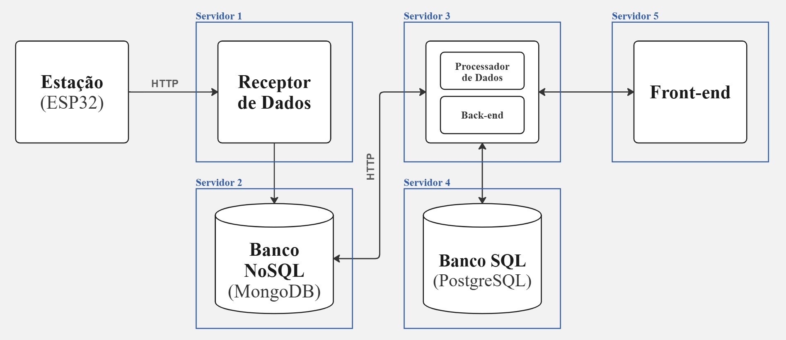

## 💻 Aprendizado por Projeto Integrado (API)
 
Projeto desenvolvido com base na Metodologia Ágil SCRUM, promovendo a colaboração entre os integrantes, a autonomia na execução das tarefas e o foco em entregas contínuas. A abordagem seguirá o ciclo CDIO — Conceber, Desenvolver, Implementar e Operar — permitindo que o grupo compreenda o desafio, proponha uma solução viável e entregue um MVP funcional.

<br>

<span id="sumario">

<div align=center>
<a href ="#projeto">Projeto</a> | <a href ="#requisitosfuncionais">Requisitos Funcionais</a> | <a href ="#requisitosnaofuncionais">Requisitos Não Funcionais</a> | <a href ="#backlog&userstories">Backlog do Produto</a> | <a href ="#dor-dod">DoR e DoD</a> | <a href ="#sprints">Sprints</a> | <a href ="#tecnologias">Tecnologias</a> | <a href ="#arquitetura">Arquitetura do Sistema</a> | <a href ="#modelagem">Modelagem de Dados</a> | <a href ="#instalacao">Guia de Instalação</a> | <a href ="#equipe">Equipe</a>
</div>

<br>

<span id="projeto">

## 📋 O Projeto
> **Status do Projeto: Em andamento**
 
A empresa Tecsus busca expandir suas soluções de IoT para o monitoramento ambiental por meio de estações meteorológicas de baixo custo. Entretanto, para que os dados coletados por essas estações sejam úteis, é necessário um sistema capaz de receber, armazenar, processar e disponibilizar essas informações de forma organizada e acessível.

O Sistema de Coleta de Dados de Estações Meteorológicos foi desenvolvido para atender essa necessidade, permitindo a coleta automatizada de dados provenientes de sensores instalados em estações meteorológicas e sua disponibilização em um sistema web com dashboards e relatórios.

A solução é direcionada principalmente a **órgãos públicos**, como instituições governamentais responsáveis pela Defesa Civil e gestão de riscos de desastres naturais, que necessitam de monitoramento climático confiável para apoiar a tomada de decisões.

<br>

<span id="requisitosfuncionais">

### 📚 Requisitos Funcionais
| Requisito | Descrição |
|-----------|-----------|
| **RF01** | **Modelo de Dados Dinâmico**: Capacidade de receber e registrar estações meteorológicas equipadas com diversos tipos de sensores. |
| **RF02** | **CRUD para Estações, Parâmetros, Alertas e Usuários**: Funcionalidades completas de criação, leitura, atualização e exclusão. |
| **RF03** | **Recepção de Dados**: Processamento e armazenamento dos dados enviados pelas estações meteorológicas. |
| **RF04** | **Dashboards e Relatórios**: Visualização interativa dos parâmetros meteorológicos e geração de pelo menos 3 relatórios estatísticos distintos. |
| **RF05** | **Geração de Alertas**: Criação automática de notificações baseadas em condições meteorológicas específicas. |
| **RF06** | **Desenvolvimento de Datalogger**: Implementação de um datalogger para registrar dados em uma estação meteorológica. |
| **RF07** | **Montagem de Estação Meteorológica**: Construção física de uma estação meteorológica com os componentes necessários. |
| **RF08** | **Tutorial Educativo**: Desenvolvimento de um guia explicativo sobre o significado de cada parâmetro meteorológico medido. |
| **RF09** | **Controle de Acesso**: Implementação de um sistema de controle de acesso com, no mínimo, dois níveis de usuário (administrador e público). | 

<span id="requisitosnaofuncionais">
 
### 📚 Requisitos Não Funcionais
| Requisito | Descrição |
|-----------|-----------|
| **RNF01** | **Experiência do Usuário (UX)**: Os dashboards devem possuir design que priorize usabilidade, clareza das informações e boa experiência visual para facilitar a análise dos dados meteorológicos. |
| **RNF02** | **Documentação de APIs**: Documentação detalhada de todas as rotas da API, incluindo descrição dos endpoints, parâmetros e exemplos de requisição e resposta. |
| **RNF03** | **Pipeline de Integração Contínua (CI)**: Implementação de pipeline para automatizar testes, validações e verificação de qualidade do código durante o desenvolvimento. |
| **RNF04** | **Deploy Automatizado**: Implementação de processo de deploy automatizado adaptado às necessidades de órgãos públicos, garantindo eficiência, escalabilidade e conformidade com padrões e infraestruturas governamentais. |
 
<br>

<span id="backlog&userstories">

## 🎯 Backlog do Produto 

| ID  | Prioridade | User Story | Sprint | Story Points |
|-----|------------|------------|--------|--------------|
| US1 | Alta | Eu como administrador, desejo realizar login na área administrativa do sistema, para acessar e gerenciar as funcionalidades administrativas da plataforma, garantindo que apenas usuários autorizados possam realizar alterações no sistema. | 1 | 13 |
| US2 | Alta | Eu como administrador, desejo cadastrar estações meteorológicas, para registrar os locais de coleta de dados climáticos. | 1 | 8 |
| US3 | Alta | Eu como administrador, desejo configurar parâmetros meteorológicos e seus limites, para definir quais variáveis ambientais serão monitoradas e identificar condições climáticas de risco. | 1 | 8 |
| US4 | Alta | Eu como administrador, desejo cadastrar novos administradores no sistema para permitir que outros usuários autorizados possam gerenciar a plataforma. | 1 | 8 |
| US5| Média | Eu como usuário do sistema, desejo visualizar as métricas das regiões cadastradas, para acompanhar e analisar as condições climáticas de cada local monitorado. | 2 | 8 |
| US6 | Média | Eu como usuário do sistema, desejo visualizar alertas climáticos gerados automaticamente quando uma medição ultrapassar um limite configurado, para identificar possíveis situações de risco ou desastres naturais. | 2 | 5 |
| US7 | Média | Eu como usuário do sistema, desejo visualizar dashboards com dados organizados por parâmetro e apresentados em gráficos e cards, para analisar variações de temperatura, umidade e outros indicadores climáticos de forma clara e eficiente. | 2 | 8 |
| US8 | Baixa | Eu como usuário do sistema, desejo visualizar guias explicativos sobre os parâmetros meteorológicos, para entender o significado das medições apresentadas. | 3 | 5 |
| US9 | Baixa | Eu como administrador, desejo gerar relatórios com dados meteorológicos coletados pelo sistema, para analisar informações climáticas e apoiar tomadas de decisão em situações de risco. | 3 | 5 |
| US10 | Baixa | Eu como administrador, desejo editar meu perfil administrativo para manter minhas informações atualizadas no sistema. | 3 | 5 |

**:link: Clique no link abaixo para visualizar mais detalhes do Backlog do Produto:** 
> [Backlog do Produto](./docs/Backlog-do-Produto.pdf)
 
<br>

<span id="dor-dod">

## ✅ DoR e DoD
### DoR Definition of Ready
Uma tarefa é considerada **pronta para ser iniciada** quando:
- História bem definida e escrita no formato: “Como [tipo de usuário], quero [funcionalidade], para [benefício]”.
- Dados de teste definidos.
- Mockups ou fluxos UX disponíveis.
- Regras de negócio claras.
- Estimada pela equipe (Story Points definidos).
- Critérios de aceitação definidos.

### DoD Definition of Done
Uma tarefa é considerada **pronta** quando:
- Código revisado e integrado.
- Testes unitários aprovados.
- Critérios de aceitação atendidos.
- Regras de negócio respeitadas.
- Documentação atualizada.
- Interface implementada conforme mockups.

<br>

<span id="sprints">

## 📅 Sprints
Sprint | Previsão | Status | Relatório | Vídeo do Projeto |
|------|--------|------|---------|----------|
|01 | 16/03/2026 - 05/04/2026 |✅ Concluído| [Ver Relatório](https://github.com/GeneSys-fatec/API-4DSM/tree/docs-sprint-1#sprint-1-16032026---05042026) | <a href='https://youtu.be/m4sEB9klfE4'>Ver Vídeo</a> |
|02|  13/04/2026 - 03/05/2026 |✅ Concluído| [Ver Relatório](https://github.com/GeneSys-fatec/API-4DSM/tree/docs-sprint-2#sprint-2-13042026---03052026) | <a href='https://youtu.be/mbkQFutfMhY'>Ver Vídeo</a> |
|03| 11/05/2026 - 31/05/2026 |⏳ Em andamento| [Ver Relatório]() | <a href=''>Ver Vídeo</a> |

<br>

<span id="tecnologias">

## 🔧 Tecnologias
 
As seguintes ferramentas, linguagens, bibliotecas e tecnologias foram usadas na construção do projeto:
 


<br>

<span id="arquitetura">

## ⚙️ Arquitetura do Sistema
### Arquitetura Lógica


### Arquitetura Física


**:link: Clique no link abaixo para visualizar mais detalhes da Arquitetura do Sistema:**
> [Arquitetura do Sistema](https://github.com/GeneSys-fatec/API-4DSM/wiki/Arquitetura-do-Sistema)

<br> 

<span id="modelagem">

## 📊 Modelagem de Dados
**:link: Clique no link abaixo para visualizar mais detalhes da Modelagem de Dados do sistema:** 
> [Modelagem de Dados](./docs/Modelagem-de-Dados.pdf)

<br>

<span id="instalacao">

## ⬇ Guia de Instalação

Este guia oferece instruções detalhadas sobre como baixar, configurar e executar este projeto em sua máquina local.

### Pré-requisitos
- **Node.js**: Ambiente de execução de JavaScript open-source. [Baixe o Node.js](https://nodejs.org/pt-br/download)
- **VSCode**: Editor de código para visualização e edição do projeto. [Baixe o VSCode](https://code.visualstudio.com/download)
- **PostgreSQL**: Banco de dados para armazenar informações necessárias ao sistema. [Baixe o PostgreSQL](https://www.postgresql.org/download/)

---

### Como Executar Localmente

#### Passos para Executar o Backend

**1. Clone o Repositório**

```bash
git clone https://github.com/GeneSys-fatec/API-4DSM-BACKEND.git
```

**2. Configuração e Execução do Backend**
> Atualize a branch:
```bash
git pull origin master 
```


> Configure o `.env` do projeto:
```bash
DB_HOST=localhost
DB_PORT=5432
DB_USERNAME=postgres
#DB_PASSWORD=[senhadb]
#DB_DATABASE=[db_utilizado]
#JWT_TOKEN=[secret_key] (32 caracteres)
```


> Instale as dependências do backend:
```bash
npm install
```


> Inicie o backend com o comando:
```bash
npm run dev
```
---

####  Passos para Executar o Frontend

**1. Clone o Repositório**

```bash
git clone https://github.com/GeneSys-fatec/API-4DSM-FRONTEND.git
```

**2. Configuração e Execução do Frontend**
> Atualize a branch:
```bash
git pull origin master 
```


> Instale as dependências do frontend:
  ```bash
  npm install 
  ```


> Inicie o frontend com o comando:
  ```bash
  npm run dev
  ```


#### 3. Acessando a Aplicação
> No terminal, copie o link que aparece e abra-o no navegador de sua preferência para acessar a aplicação.

<br>

<span id="equipe">

## 👤 Equipe
|    Função     | Nome                                  |                                                                                                                                                      LinkedIn & GitHub                                                                                                                                                      |
| :-----------: | :------------------------------------ | :-------------------------------------------------------------------------------------------------------------------------------------------------------------------------------------------------------------------------------------------------------------------------------------------------------------------------: |
| Product Owner | Marianne Valério Nunes |         [](https://www.linkedin.com/in/marianne-valério-nunes-701568292/) [](https://github.com/mariannevalerion)        |
| Scrum Master |   Ana Beatriz Coelho         |     [](https://www.linkedin.com/in/abeatrizcoelho/) [](https://github.com/abeatrizdscoelho)              |
| Team Member | Ana Júlia Gaspar |         [](https://www.linkedin.com/in/ana-gaspar-957775325/) [](https://github.com/anajgaspar)        |
| Team Member |   Emmanuel Yokoyama         |     [](https://www.linkedin.com/in/emmanuelyokoyama/) [](https://github.com/EmmanuelJYokoyama)              |
| Team Member  | Gabriel Calebe |      [](https://www.linkedin.com/in/gabriel-medeiros-516ab3325/) [](https://github.com/gbmedeiros00)          |
| Team Member |   Gabriel Robert (_interrompido_)      |     []() []()              |
| Team Member |   Giovanni Kanjiscuk      |     [](https://www.linkedin.com/in/giovanni-kanjiscuk/) [](https://github.com/GKanjiscuk)              |
| Team Member | Francisco Rafael Pires |      []() [](https://github.com/franciscorafaelpires)          |

<br>

→ <a href="#sumario"> Voltar ao topo </a>
